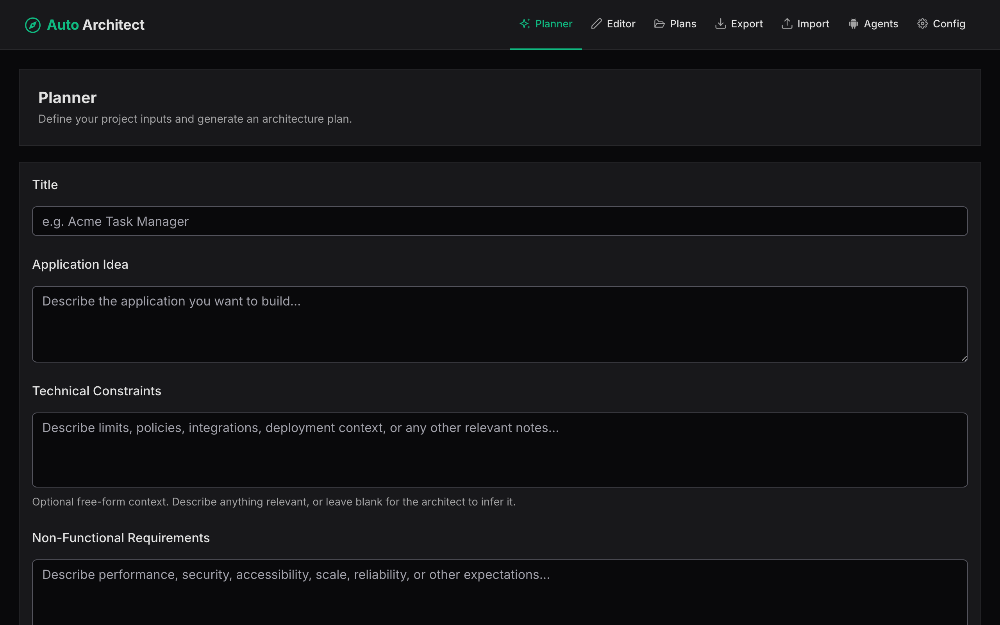
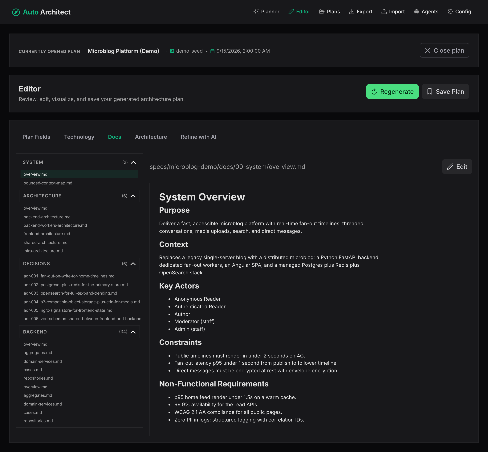
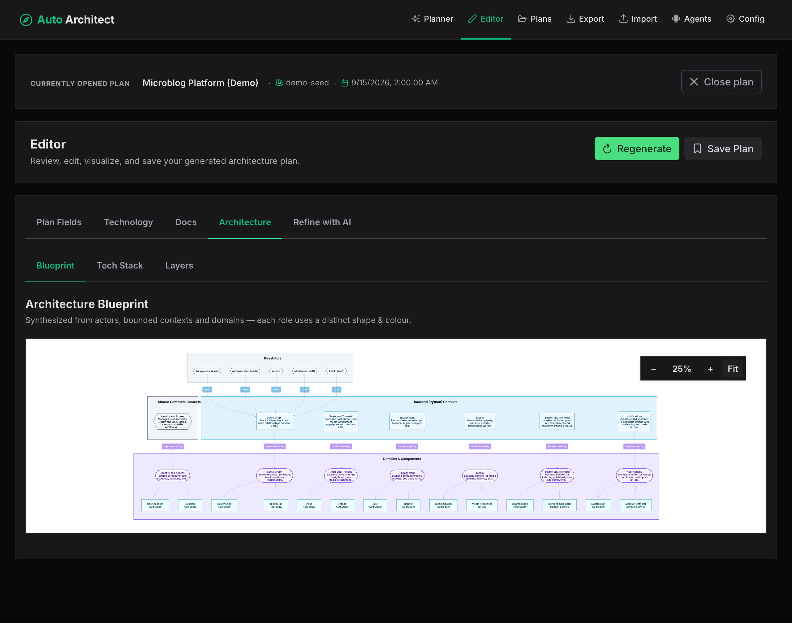

# Auto Architect

> Turn an idea into a full, edit-ready architecture plan in the browser.

**Live demo:** <https://mateuszpsuja.github.io/autoArchitect/>



[](https://mateuszpsuja.github.io/autoArchitect/)
[](https://angular.dev)
[](https://js.langchain.com)
[](https://mermaid.js.org)
[](./LICENSE)
[](./AGENTS.md)

Auto Architect is a frontend-only Angular 21 app that streams a
[spec-kit](https://github.com/github/spec-kit/blob/main/spec-driven.md)
architecture plan from any supported LLM provider, validates it against a
Zod schema, and lets you browse, edit, diagram, and export the result — all
in the browser.

## Features

- Streams a spec-kit-style plan (Summary, Technical Context, Constitution
  Check, Project Structure, Complexity Tracking, per-domain docs) per
  architecture layer, validated by Zod.
- Inline markdown editor with file-tree navigation and live Mermaid
  diagrams per layer.
- Save plans locally, reload later, audit and auto-repair broken Mermaid.
- Export the plan as a ZIP of markdown files or as a designed PDF.
- Refine-with-AI chat that re-architects the plan from your answers.
- 100% frontend. Bring your own API key.

## Screenshots

| Editor | Architecture diagram |
| --- | --- |
|  |  |

## Sample export

A complete demo plan — "Microblog Platform (Demo)" — generated by Auto
Architect and exported straight from the running app. Use it to see what a
real, end-to-end output looks like before you run the planner yourself.

| File | Format | What it contains |
| --- | --- | --- |
| [`001-microblog-demo-spec.pdf`](./export/001-microblog-demo-spec.pdf) | PDF (~686 KB, 19 pp) | Full spec as a designed PDF, generated by the in-app PDF generator. |
| [`001-microblog-demo-docs.zip`](./export/001-microblog-demo-docs.zip) | ZIP (~320 KB) | The `docs/**` markdown tree — drop into any repo. |
| [`001-microblog-demo-plan.json`](./export/001-microblog-demo-plan.json) | JSON (~132 KB) | The raw `Plan` object, validated against the Zod schema; loadable by Auto Architect via "Load plan". |

All three files are committed to `export/` so you can inspect the end-to-end
output without running the planner yourself.

## Quick start

```bash
npm install
npm start          # http://localhost:4200
```

On first run, open `/config`, paste your provider's API key, pick a model, then
go to `/planner`, describe your idea, and click **Generate Plan**.

## Development

```bash
npm test               # Vitest suite (unit + component specs)
npm run build          # production build into dist/
npm run screenshots    # regenerate docs/screenshots/*.png
npm run export:demo    # regenerate export/microblog-demo-{plan.json,docs.zip,spec.pdf} (PDF requires configured LLM)

# Optional: Playwright E2E suite (separate from `npm test`)
npm run e2e:install    # one-time: download Chromium for Playwright (~150 MB)
npm run e2e            # runs e2e/*.spec.ts against a fresh dev server
npm run e2e:ui         # interactive Playwright UI mode
```

Architectural rules and contributor expectations live in
[`AGENTS.md`](./AGENTS.md).

## Contributing

For non-trivial changes, open an issue first to agree on direction.
See [`AGENTS.md`](./AGENTS.md) for coding style and testing rules.

## License

MIT — see [`LICENSE`](./LICENSE).